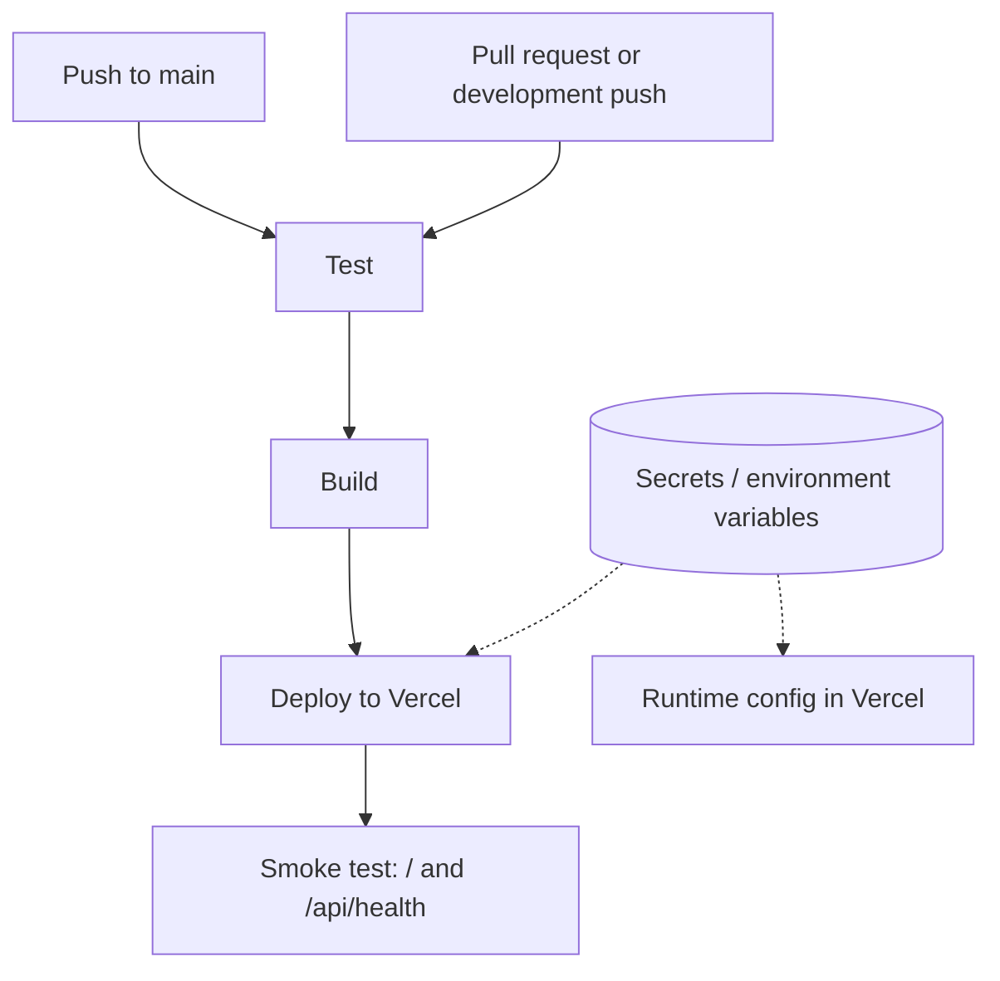

# CI/CD Diagram

This diagram shows the automated delivery path for Gasync.

Pipeline notes:

- `main` pushes run `test -> build -> deploy -> smoke test`.
- Pull requests and non-production pushes still run `test -> build`.
- Deployment secrets stay in GitHub or Vercel environment variables, not in the repo.

Required secret values:

- `VERCEL_TOKEN`
- `VERCEL_ORG_ID`
- `VERCEL_PROJECT_ID`
- `COMMODITY_API_KEY` in Vercel production runtime settings